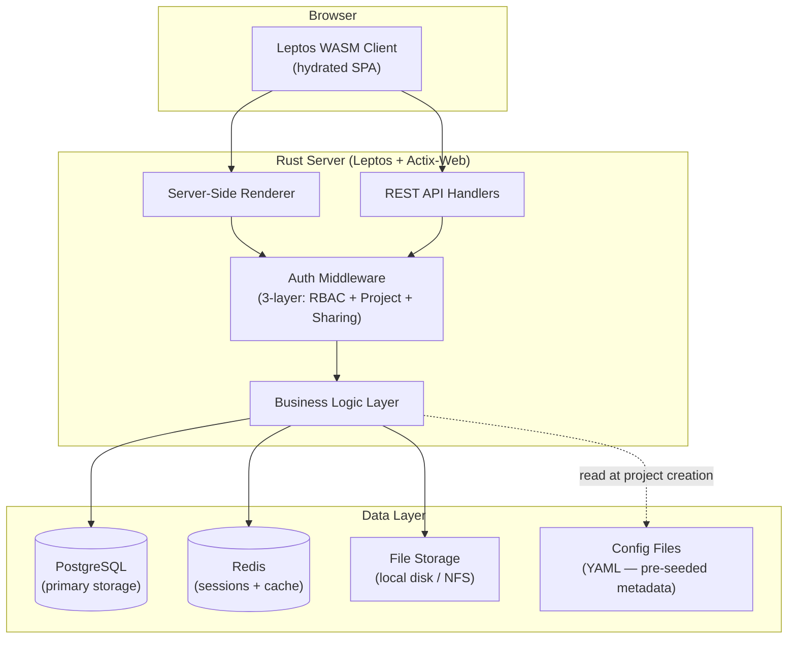
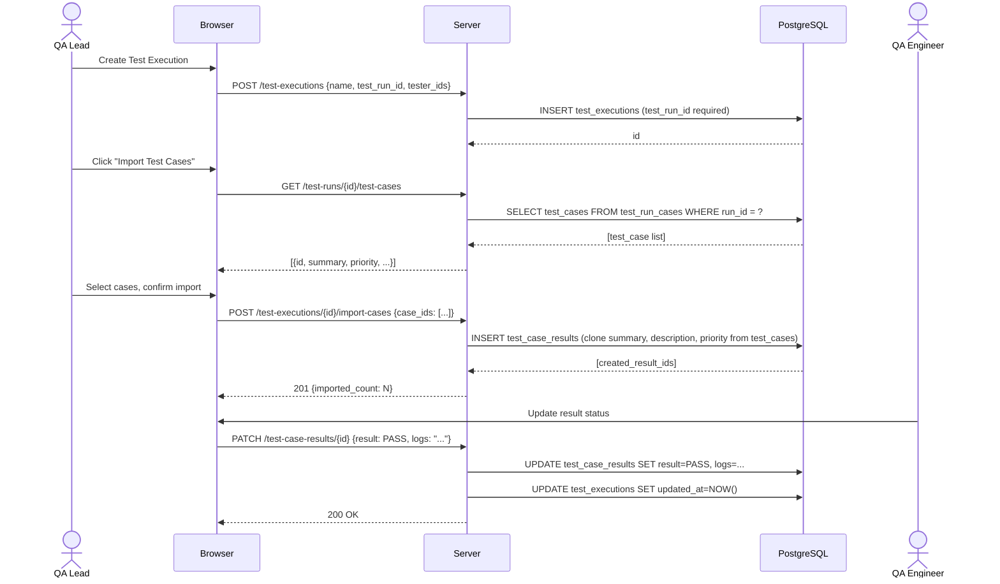
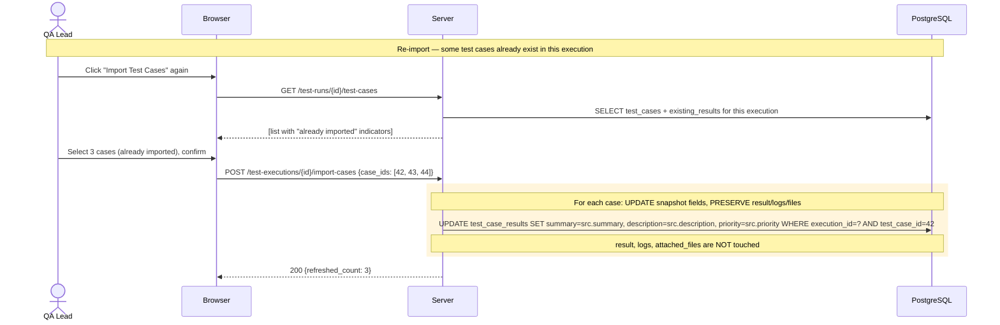
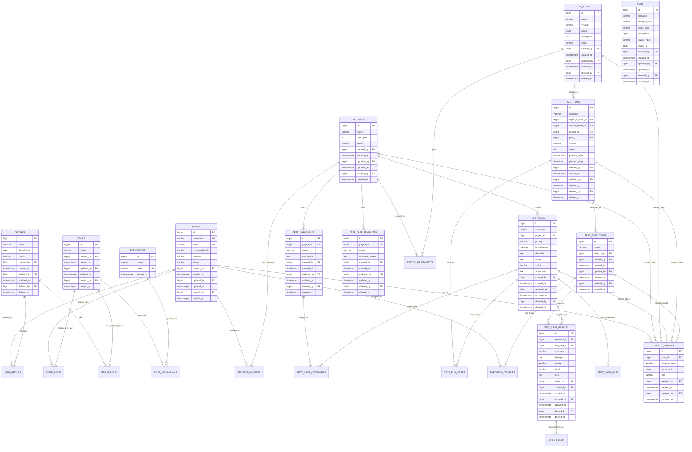
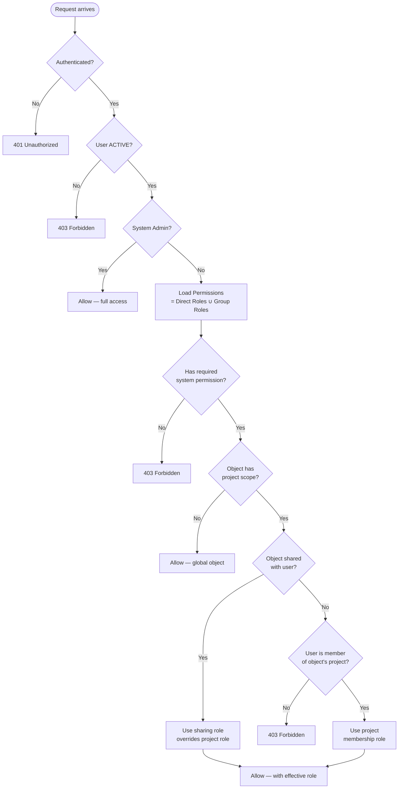
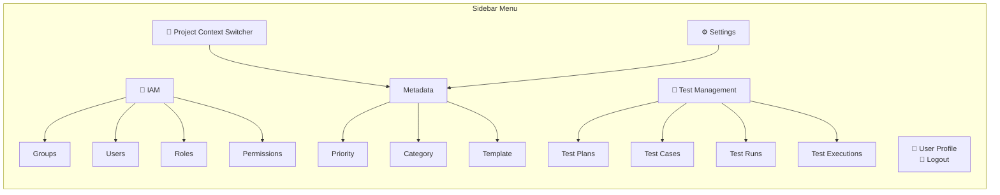

# PRD — HOA Test Case Management System (TCMS)

**Version:** 3.2
**Status:** Draft
**Author:** Product Team
**Last Updated:** 2026-07-11
**Stakeholders:** PM, Engineering Lead, QA Lead

---

## 1. Overview / Context

### 1.1 Problem Statement

QA teams lack a centralized, role-controlled system to author test cases, organize them into plans,
execute runs, and track results across multiple projects — forcing reliance on spreadsheets, ad-hoc
tools, and manual status aggregation.

### 1.2 Background / Context

- Testing workflows today are fragmented: test cases in spreadsheets, execution tracking in separate
  tools, no structured link between plans → runs → results.
- No single source of truth for test coverage across projects.
- Phase 2 will add Jira integration to link test cases, bugs, and releases bidirectionally.

### 1.3 Goals

| # | Goal | Metric | Target |
|---|------|--------|--------|
| G-01 | Centralize test case authoring and organization | All test cases managed in-system | 100% adoption by target teams |
| G-02 | Enable structured test execution tracking | Test runs created → executed → reviewed within the system | End-to-end workflow without external tools |
| G-03 | Provide role-based access control across all objects | Fine-grained permissions per project, per object type | Users can only see/act on authorized objects |
| G-04 | Support multi-project test plans | One test plan spans N projects | Cross-project regression/integration testing |

### 1.4 Non-Goals

- This project will **not** provide a test automation engine (scripts are referenced, not executed).
- This project will **not** replace Jira — it integrates with Jira in Phase 2.
- This project will **not** provide real-time CI/CD pipeline triggering.
- Out of scope: built-in reporting dashboards with charts (Phase 3).
- Out of scope: public REST API for third-party integrations (Phase 3).
- Out of scope: email/push notifications (Phase 3).

---

## 2. Objectives & Success Metrics

### 2.1 KPIs / OKRs

| Objective | Key Result | Current Baseline | Target |
|-----------|------------|------------------|--------|
| O-01: Test case centralization | Number of test cases stored and managed in TCMS | 0 (new system) | 500+ within 3 months |
| O-02: Workflow efficiency | Time from test plan creation to execution completion | Manual/adhoc | < 1 day for a 50-case run |
| O-03: Access control correctness | Zero permission bypass incidents in penetration testing | N/A | 0 critical findings |
| O-04: Multi-project support | Test plans spanning ≥ 2 projects created successfully | N/A | 10% of all test plans |

### 2.2 Acceptance Criteria (High-Level)

- [ ] AC-01: A user with appropriate permissions can create projects, test plans, test cases, test runs, and test executions.
- [ ] AC-02: A user can import a selected subset of test cases from a test run into a test execution.
- [ ] AC-03: Each test case result in an execution is independent — updating one does not affect others.
- [ ] AC-04: The System Admin can create users, assign roles, and manage group membership.
- [ ] AC-05: Unauthenticated users cannot access any page except Login.
- [ ] AC-06: A test plan can reference test cases from multiple projects.
- [ ] AC-07: Re-importing a test case refreshes its snapshot fields (summary, description, priority) but preserves existing result status, logs, and attached files.

### 2.3 Business Impact

- **Risk reduction:** Structured test tracking with audit trail reduces the risk of untested changes
  reaching production.
- **Efficiency:** Eliminates manual collation of test results from spreadsheets and emails.
- **Compliance:** Role-based access ensures separation of duties (tester vs. reviewer vs. admin).

---

## 3. Users & Use Cases

### 3.1 User Personas

| Persona | Role | Technical Level | Primary Motivation | Pain Today |
|---------|------|-----------------|--------------------|------------|
| System Admin | IAM administrator | Intermediate | Provision users, assign roles, configure system metadata | Manual account management, no centralized permission model |
| QA Lead / Manager | Test strategist | Intermediate–Expert | Define test plans across projects, review run results, track coverage | Spreadsheets scattered across projects, no cross-project view |
| QA Engineer | Tester | Intermediate | Execute test runs, record results, attach evidence, report bugs | Results recorded in separate docs, hard to correlate with test cases |
| Developer | Occasional tester | Intermediate–Expert | View test cases assigned to them, execute ad-hoc runs | No visibility into what tests exist for their changes |
| Project Owner | Stakeholder | Novice–Intermediate | View test status and results for their project | Status requests go through QA Lead, slow feedback loop |

### 3.2 Key User Journeys

#### Journey 1 — End-to-End Test Execution Workflow

1. **QA Lead** creates a **Test Plan** ("Sprint 12 Regression") spanning 2 projects, sets type to
   REGRESSION + FUNCTIONAL.
2. **QA Lead** creates a **Test Run** from the plan, assigns default tester, sets planned dates,
   and adds 30 relevant test cases.
3. **QA Lead** creates a **Test Execution** ("Build 3.2.1 Execution"), selects the Test Run
   (required), and selectively imports 15 test cases from the run via a checkbox dialog.
4. **QA Engineer** opens the execution, runs each test case, updates each result to PASS/FAIL,
   attaches screenshots and logs where needed.
5. **QA Lead** (as Report-to reviewer) reviews results. When all executions are complete and
   no IN PROGRESS runs remain, marks the Test Plan status to DONE.

**Success state:** All 15 results recorded, artifacts attached, plan status updated to DONE.
**Failure/edge state:** If a test case fails, QA Engineer creates a Jira bug ticket from the
result (Phase 2). Test case can be re-executed in a new execution without altering the old one.
If the QA Lead re-imports a test case mid-execution, the snapshot fields refresh but the
existing result status and logs are preserved.

#### Journey 2 — User Provisioning and Access Grant

1. **System Admin** creates a new **User** (username, email, password ≥ 8 chars, full name).
2. **System Admin** assigns the user to a **Group** ("QA Engineers").
3. The **Group** already has a **Role** ("Tester") which grants permissions: Read Test Case,
   Read List Test Case, Update Test Execution Result.
4. **System Admin** adds the user as a **Project Member** with role **Editor** on Project A.
5. **User** logs in — can see and execute test runs in Project A, but cannot access Project B.

**Success state:** User can perform authorized actions within assigned project scope.
**Failure/edge state:** If user is deactivated (Status = INACTIVE), login is rejected even if
roles and memberships remain.

#### Journey 3 — Test Case Authoring with Templates

1. **QA Engineer** navigates to Test Cases under a **selected project context**, clicks **Add New**.
2. Selects **Category** (multiple, from project's categories), sets **Priority** (from project's
   priority scale), toggles **Automated** if applicable.
3. Chooses a **Test Case Template** — the description field auto-fills with structured sections:
   Preconditions, Steps, Expected Results.
4. Edits the description for this specific case, adds notes, attaches reference files.
5. Saves — test case appears in the project's list view, ready to be added to test runs.

**Success state:** Test case created with structured description from template, files attached.
**Failure/edge state:** If no template is selected, description starts blank. Template content
is a starting point, not a constraint. If no project is selected, the test case is orphaned —
visible only to its creator and explicitly shared users.

#### Journey 4 — Re-Importing Updated Test Cases

1. **QA Lead** created Test Execution A, imported 10 test cases.
2. Later, 3 of those test cases are **updated** in the source (summary changed, priority raised).
3. **QA Lead** creates Test Execution B from the same Test Run, imports the same 3 test cases.
4. Execution B gets the **updated** snapshot (new summary, new priority).
5. Execution A keeps the **original** snapshot — frozen at import time.
6. **QA Lead** wants to refresh Execution A: clicks "Import Test Cases" again, selects the
   3 updated cases. Snapshot fields (summary, description, priority) are refreshed. Existing
   result statuses (PASS/FAIL), logs, and attached files are **preserved**.

**Success state:** Snapshots updated, tester's work intact.
**Failure/edge state:** If a test case was deleted from the source after import, re-import
dialog shows it as unavailable.

### 3.3 Pain Points

- **Fragmented test data:** Test cases, plans, and results live in separate files/tools with no
  relational link. No single view of "what tests exist for this feature, and were they run?"
- **Manual status reporting:** QA leads spend hours compiling test run results into status
  reports for stakeholders.
- **No cross-project visibility:** A regression plan that spans projects requires manual
  coordination across project boundaries.
- **Accidental result overwrites:** In shared spreadsheets, one tester's update can overwrite
  another's without audit trail.

---

## 4. Functional Requirements

### Priority Legend

- **Must-have (P1):** Required for Phase 1 launch. Blocking if absent.
- **Should-have (P2):** High value; include if schedule permits.
- **Nice-to-have (P3):** Defer to future phase.
- **Phase 2:** Scheduled for next delivery phase.

---

### 4.1 Identity & Access Management

| ID | Requirement | Priority | Notes / Edge Cases |
|----|-------------|----------|--------------------|
| FR-01 | The system **must** authenticate users via (username OR email) + password. | P1 | Password stored as `pbkdf2$<algorithm>$<salt>$<iterations>$<hash>`. Minimum password length: 8 characters. |
| FR-02 | The system **must** reject login for users with Status = INACTIVE. | P1 | Same error message as wrong credentials to avoid user enumeration. No account lockout after failed attempts. |
| FR-03 | The system **must** support Users, Groups, Roles, and Permissions as distinct entities. | P1 | See data model in §6.3. |
| FR-04 | A Role **must** aggregate multiple Permissions. A User **must** receive permissions from directly assigned Roles AND from Roles assigned to their Groups. | P1 | Union of all permissions across user roles + group roles. |
| FR-05 | The system **must** ship with a `System Admin` role that has all permissions. | P1 | First admin created via CLI init command. System Admin bypasses all project-scope checks. |
| FR-06 | The system **must** allow a user to update their own profile (full name, email) and password. | P1 | Password change requires current password confirmation. |
| FR-07 | The system **must** enforce object-level permissions: Create, Read, Read List, Update, Select, Delete. | P1 | Select = can pick the object in a selection/dropdown field (ID + Name only). Read List = can browse the list view. Read = can view full detail. |
| FR-08 | The system **must** support user Status: ACTIVE or INACTIVE. Default ACTIVE. | P1 | Deactivation revokes access immediately without deleting data. |
| FR-09 | Username and Email **must** each be unique across all users. | P1 | Case-insensitive comparison. |

### 4.2 Authorization Model

The system enforces three-layer authorization:

| Layer | Scope | Mechanism |
|-------|-------|-----------|
| **System RBAC** | Global | Users get permissions via roles (direct assignment + group inheritance). Permissions define what **actions** a user can perform (Create, Read, Update, etc.). |
| **Project Membership** | All objects within a project | User assigned a role (Owner, Editor, Contributor, Viewer) on a project. Grants scope-based access to all objects in that project. |
| **Object Sharing** | Individual objects | Individual objects (Test Plan, Test Case, Test Run, Test Execution) shared with specific users with roles: Editor, Contributor, Viewer. **Overrides** project membership for that specific object. |

**Access decision:** A user is granted access to an object when:
1. They hold the required system permission (e.g., `test_case:update`) — **action check**, AND
2. They are a member of the object's project OR the object is shared with them — **scope check**.

When both project membership and object sharing apply to the same object, the **sharing role wins**
(higher or lower — sharing overrides the project-level role for that specific object).

**Status transition priority chain** (for Test Plan status changes):
Owner of the object → Editor (sharing) → Project membership role → System permissions.
A user at a higher priority can change status even if lower-priority users also have access.

| ID | Requirement | Priority | Notes / Edge Cases |
|----|-------------|----------|--------------------|
| FR-10 | The system **must** check system RBAC permissions for every request (action check). | P1 | System Admin bypasses this check. |
| FR-11 | The system **must** verify project membership OR object sharing for project-scoped objects (scope check). | P1 | System Admin bypasses this check. Orphaned objects (no project) are visible only to creator and shared users. |
| FR-12 | Per-object sharing **must** override project membership role for that specific object. | P1 | Example: user is Viewer on Project X → cannot edit most objects. But a specific Test Run shared as Editor → user CAN edit that Test Run. |

### 4.3 Project Management

| ID | Requirement | Priority | Notes / Edge Cases |
|----|-------------|----------|--------------------|
| FR-13 | The system **must** support Project CRUD with fields: Name, Description, Status (ACTIVE/INACTIVE). | P1 | Soft-delete only. No cascade delete. Creating a project auto-seeds per-project metadata from the configuration file. |
| FR-14 | The system **must** support Project Members with roles: Owner, Editor, Contributor, Viewer. | P1 | Owner can manage members. Editor can modify project and its objects. Contributor can modify objects but not share. Viewer is read-only. |
| FR-15 | Only users with `project:create` system permission **may** create projects. | P1 | |

### 4.4 Metadata Management (Per-Project)

All metadata (Categories, Priorities, Templates, Test Plan Types) is **per-project**. When a project
is created, default metadata is seeded from the application configuration file. Users manage
metadata within the **current project context** selected in the UI.

| ID | Requirement | Priority | Notes / Edge Cases |
|----|-------------|----------|--------------------|
| FR-16 | The system **must** support Test Category CRUD per project: Name (required), Description. | P1 | Pre-seeded from config on project creation. |
| FR-17 | The system **must** support Test Case Template CRUD per project: Name (required), Template content (rich text). | P1 | Pre-seeded from config on project creation. |
| FR-18 | The system **must** support 5 priority levels per project: HIGHEST, HIGH, MEDIUM, LOW, LOWEST. Default on new test case: MEDIUM. | P1 | Pre-seeded from config on project creation. Custom priority scales per project via config. |
| FR-19 | Test Plan types (ACCEPTANCE, FUNCTIONAL, API, INTEGRATION, PERFORMANCE, REGRESSION, SECURITY) **must** be defined in the configuration file and seeded per project. | P1 | Admin can customize types in config before project creation. |
| FR-20 | The Settings → Metadata section **must** operate within the user's current project context. | P1 | Categories, Priorities, and Templates displayed are for the currently selected project. |

### 4.5 Test Case Management

| ID | Requirement | Priority | Notes / Edge Cases |
|----|-------------|----------|--------------------|
| FR-21 | The system **must** support Test Case CRUD with fields: Summary (required), Project (optional), Category (multi-select, from project's categories), Priority (from project's priority scale, default MEDIUM), Automated (toggle, default false), Description (rich text), Notes (rich text), Script (Phase 2), Arguments (Phase 2). | P1 | Summary acts as the test case name. Script and Arguments are stored but unused in Phase 1. |
| FR-22 | The system **must** allow selecting a Test Case Template when creating/editing a Test Case, which populates the Description field with the template content. | P1 | User can edit the populated content freely. Templates are scoped to the test case's project. |
| FR-23 | The system **must** support attaching files to Test Cases. | P1 | Reference files, screenshots, documents. Storage directory configurable via environment variable. |
| FR-24 | A Test Case with no Project assigned (orphaned) **must** be visible only to its creator and explicitly shared users. | P1 | Cannot be added to a Test Run by users who don't have visibility. |

### 4.6 Test Plan Management

| ID | Requirement | Priority | Notes / Edge Cases |
|----|-------------|----------|--------------------|
| FR-25 | The system **must** support Test Plan CRUD with fields: Name (required), Project (multi-select, required), Version (default "UNSPECIFIED"), Type (multi-select, from project-seeded types), Description (rich text), Status (TO DO, IN PROGRESS, DONE, CANCEL; default TO DO). | P1 | A test plan can span multiple projects. |
| FR-26 | The system **must** validate that a Test Plan cannot be set to DONE while any linked Test Run has Test Case Results in IN PROGRESS status. | P1 | Validation runs on status change attempt. Error message lists the blocking runs. |
| FR-27 | Test Plan status **must** be changeable by users according to the permission priority chain: Object Owner → Sharing Editor → Project membership → System permission. | P1 | A user higher in the chain can change status even if lower-priority users also have access. |
| FR-28 | The system **must** display a tabular list of Test Runs linked to the Test Plan on its detail view. | P1 | Read-only listing with links to each run. |
| FR-29 | The system **must** allow adding/removing Test Runs from a Test Plan on the create/update view. | P1 | A run can belong to at most one plan. |

### 4.7 Test Run Management

| ID | Requirement | Priority | Notes / Edge Cases |
|----|-------------|----------|--------------------|
| FR-30 | The system **must** support Test Run CRUD with fields: Summary (required), Report To (single user link, optional — reserved for Phase 3 notifications), Default Tester (default: current user), Project (single select, optional), Plan (single select, optional), Version, Notes (rich text), Planned Start (datetime), Planned Stop (datetime). | P1 | |
| FR-31 | The system **must** allow adding/removing Test Cases to a Test Run on the create/update view via a tabular interface. | P1 | Test cases can come from any project the user has access to. No constraint based on the linked Plan's projects. |
| FR-32 | The system **must** display a tabular list of Test Cases in the Test Run on its detail view. | P1 | |
| FR-33 | The system **must** display a tabular list of Test Executions linked to the Test Run on its detail view. | P1 | |
| FR-34 | The system **must** display a Statistics section on the Test Run detail view aggregating Test Case Result statuses: total results, NOT TESTED count, IN PROGRESS count, PASS count, FAIL count, WARNING count, IGNORE count. | P1 | Computed from the results of all executions under this run. Updated on page load. |
| FR-35 | The result of a Test Case in one Test Run **must not** affect its result in any other Test Run. | P1 | Results are scoped to the Run–Execution context. |

### 4.8 Test Execution Management

| ID | Requirement | Priority | Notes / Edge Cases |
|----|-------------|----------|--------------------|
| FR-36 | The system **must** support Test Execution CRUD with fields: Name (required), Tester (multi-select user), Test Run (single select, **required**). | P1 | Every execution must belong to a Test Run. |
| FR-37 | The system **must** provide an "Import Test Cases" button when a Test Run is selected. Clicking opens a dialog where the user selectively checks which test cases to import. | P1 | Imported test cases become Test Case Results in this execution. |
| FR-38 | Each imported Test Case Result **must** clone the test case's summary, description, and priority at import time (snapshot). Additional fields: Result (NOT TESTED, IN PROGRESS, PASS, FAIL, WARNING, IGNORE; default NOT TESTED), Attached Files, Logs (text area). | P1 | Snapshot is frozen at import time. Original test case changes do not retroactively alter existing results. |
| FR-39 | Re-importing a test case that already exists in the execution **must** refresh the snapshot fields (summary, description, priority) from the current source test case, but **must preserve** the existing Result status, logs, and attached files. | P1 | Enables updating metadata without losing tester work. |
| FR-40 | The system **must** allow updating each Test Case Result's status, attached files, and logs independently. | P1 | `tested_by` is set once when the result first transitions away from NOT TESTED, and is not modified thereafter. `updated_by` changes on every subsequent UPDATE per the audit column rules. |
| FR-41 | The system **must** allow adding additional test cases to the execution beyond those imported from the run. | P1 | |
| FR-42 | The result of a Test Case in one Test Execution **must not** affect its result in any other Test Execution. | P1 | Execution-scoped isolation. |
| FR-43 | The Test Execution detail view **must** show: execution info, list of Test Case Results (each updatable inline), with the ability to drill into each result's detail. | P1 | |
| FR-44 | A user with permission on a Test Execution **must** have the same permission level on its Test Case Results. | P1 | Permission inheritance from execution to its children. |
| FR-45 | Concurrent updates to results by multiple testers **must** use last-write-wins semantics. | P1 | No optimistic locking for MVP. |

### 4.9 File Upload

| ID | Requirement | Priority | Notes / Edge Cases |
|----|-------------|----------|--------------------|
| FR-46 | The system **must** support attaching files to Test Cases and Test Case Results. | P1 | Storage directory configurable via environment variable. |
| FR-47 | The system **must** enforce file size and type restrictions. | P1 | Configurable max size. Allowed types: PNG, JPG, PDF, TXT, ZIP, CSV, JSON, XML. |

### 4.10 Sharing

| ID | Requirement | Priority | Notes / Edge Cases |
|----|-------------|----------|--------------------|
| FR-48 | The system **must** allow sharing Projects, Test Plans, Test Cases, Test Runs, and Test Executions with specific users. | P1 | Sharing roles: Editor, Contributor, Viewer. |
| FR-49 | Sharing **must** be managed via a tabular interface on the create, update, and detail views of each shareable object. | P1 | |
| FR-50 | Editor on a shared object **may** edit the object AND share it further. Contributor **may** edit but NOT share. Viewer **may** only view. | P1 | |
| FR-51 | Per-object sharing role **must** override the user's project membership role for that specific object. | P1 | Example: Project Viewer + object shared as Editor → user has Editor access on that object. |

### 4.11 Soft Delete & Data Lifecycle

| ID | Requirement | Priority | Notes / Edge Cases |
|----|-------------|----------|--------------------|
| FR-52 | The system **must** use soft-delete (`deleted_at` timestamp, `deleted_by` user reference) for all entities. No hard delete. | P1 | Deleted records are hidden from all views. `deleted_by` records who performed the deletion and is **always populated** on application-performed soft-deletes. NULL only from direct DB operations outside the application. Junction tables and OBJECT_SHARING use hard delete (no soft-delete). |
| FR-53 | Deleting a parent entity **must not** cascade-delete children. Children are hidden while parent is deleted. | P1 | Deactivated projects hide their test cases, runs, and executions from views. Data is preserved. |
| FR-54 | Deactivated objects (Status = INACTIVE) **must** be hidden from list views and selection fields, but existing references remain intact. | P1 | |
| FR-54a | Every mutable table **must** have audit column pairs: `created_at` & `created_by`, `updated_at` & `updated_by`, `deleted_at` & `deleted_by`. All timestamp columns are `TIMESTAMPTZ NOT NULL` except `deleted_at` (nullable). All `_by` columns are `BIGINT NOT NULL` FK → `users.id` except: `deleted_by` (nullable), and `users.created_by` (nullable — the CLI bootstrap admin has no creator). | P1 | Read-only reference tables (e.g. `permissions`) carry only `created_at`. Junction tables get `created_at` only (hard delete, no audit pairs). |
| FR-54b | On first insert, the system **must** set `updated_at = created_at` and `updated_by = created_by`. On subsequent updates, only `updated_at` and `updated_by` are modified; `created_at` and `created_by` are immutable after insert. | P1 | `updated_at`/`updated_by` auto-maintained by DB trigger (`BEFORE UPDATE` sets them to `NOW()` and current user). Immutability of `created_at`/`created_by` enforced at application layer (repository rejects writes with a clear error). |
| FR-54c | The application **must** reject UPDATE operations on soft-deleted rows (`deleted_at IS NOT NULL`), except for: (a) the initial soft-delete itself which sets `deleted_at` and `deleted_by`, and (b) a restore operation which clears `deleted_at` and `deleted_by` to NULL. | P1 | Prevents accidental modification of dead records. Restore may be implemented in a future phase. |

### 4.12 General UI Rules

| ID | Requirement | Priority | Notes / Edge Cases |
|----|-------------|----------|--------------------|
| FR-55 | Every list view **must** have: checkbox as first column, action icons (Duplicate, Edit, Activate/Deactivate, Delete) as last column. | P1 | Actions displayed conditionally based on user permissions. |
| FR-56 | Clicking the ID or Name of a row **must** navigate to the detail or update page based on user permissions. | P1 | Read permission → detail view. Update permission → update view. |
| FR-57 | Pagination **must** support page sizes: 10, 25 (default), 50, 100. Preference stored in cookie. | P1 | Server-side pagination. |
| FR-58 | Every list page **must** have an "Add New" button and filter controls. | P1 | |
| FR-59 | The sidebar menu **must** organize navigation as: IAM (Groups, Users, Roles, Permissions), Settings (Metadata → Priority, Category, Template — scoped to current project), Test Management (Test Plan, Test Cases, Test Runs, Test Executions). Bottom: User Profile, Logout. | P1 | |
| FR-60 | The system **must** support a project context switcher to change which project's metadata and scoped views are active. | P1 | |

### 4.13 Phase 2 — Jira Integration

| ID | Requirement | Priority | Notes / Edge Cases |
|----|-------------|----------|--------------------|
| FR-61 | The system **may** allow configuring Jira integration via Personal Access Token. | Phase 2 | Stored encrypted. |
| FR-62 | The system **may** link a Project to one or more Jira Projects. | Phase 2 | Configured on Project create/update. |
| FR-63 | The system **may** link a Test Plan to Jira Releases. | Phase 2 | Configured on Plan create/update. |
| FR-64 | The system **may** link a Test Case to Jira Issues (related issues and discovered bugs). | Phase 2 | Displayed as linked Jira IDs on detail/update views. |
| FR-65 | The system **may** create a Jira bug ticket from a Test Case Result. | Phase 2 | "Create Jira Bug" action on failed results. |

### 4.14 Phase 2 — Automation Integration

| ID | Requirement | Priority | Notes / Edge Cases |
|----|-------------|----------|--------------------|
| FR-66 | The system **may** use the Script and Arguments fields on Test Cases to trigger or reference external automation test runs. | Phase 2 | Fields stored in Phase 1, integration logic in Phase 2. |

### 4.15 Phase 3 — Notifications

| ID | Requirement | Priority | Notes / Edge Cases |
|----|-------------|----------|--------------------|
| FR-67 | The system **may** notify the Report To user when a Test Run's execution results change. | Phase 3 | Email or in-app notification. |

---

## 5. Non-Functional Requirements

### 5.1 Performance

| Metric | Target | Notes |
|--------|--------|-------|
| Page load time (initial) | < 2s | Server-side rendered via Leptos |
| List view with 100 rows | < 500ms | With server-side pagination |
| Test Execution result update | < 300ms | Single result status change |
| Concurrent users | 50 | Typical QA team size |

### 5.2 Scalability

- Expected users at launch: 20–50
- Expected users at 12 months: 200
- Expected load at peak: 50 concurrent sessions
- Horizontal scaling: Stateless application tier; session state in Redis.

### 5.3 Security

- **Authentication:** Session-based with secure HTTP-only cookies. Password hashing via PBKDF2.
  Minimum password length: 8 characters. No account lockout on failed attempts.
- **Authorization:** Three-layer model — System RBAC (action check) + Project Membership/Sharing
  (scope check). See §4.2 for details. Sharing overrides project membership.
- **Data classification:** Internal. No PII beyond name, email, username.
- **Encryption at rest:** PostgreSQL with encrypted storage; file uploads stored on encrypted volume.
- **Encryption in transit:** TLS 1.2+ required.
- **OWASP Top 10:** Mitigate all applicable risks (XSS, CSRF, SQL Injection, broken access control,
  security misconfiguration, sensitive data exposure).
- **XSS prevention:** All user-controlled display fields (fullname, group name, role name,
  group/role description) must be sanitised on input (strip HTML tags) and output-encoded at
  the presentation layer. Defence-in-depth requires both input sanitisation and output encoding.
- **Session security:** Session cookies carry `HttpOnly`, `Secure`, and `SameSite=Lax` flags.
  Sessions are fingerprinted with the User-Agent hash to detect cookie theft. On password change
  or user deactivation/soft-delete, all existing sessions are forcibly invalidated.
- **Password change security:** Changing the password invalidates ALL existing sessions for that
  user (including the current session), forcing re-authentication. This prevents an attacker
  with a stolen session from retaining access after the legitimate user changes their password.
- **Secrets:** Zero secrets in source code. All credentials via environment variables or YAML config.
- **Secrets storage:** Jira PAT (Phase 2) encrypted before storage.

### 5.4 Reliability

| SLA | Target |
|-----|--------|
| Uptime | 99.5% (business hours) |
| RTO | < 4 hours |
| RPO | < 1 hour (database backups) |

- **Failure modes:** If Redis is unavailable, session data is lost — users must re-authenticate.
  Application remains available for new logins.
- **Graceful degradation:** If file storage is full, uploads fail with a clear error message;
  all other operations continue.

### 5.5 Compliance & Regulatory

- No specific regulatory framework required (internal tool).
- Password storage follows current best practices (PBKDF2 with configurable iterations).

---

## 6. Solution / Design

### 6.1 Architecture Overview

**Stack decisions:**
- **Rust + Leptos:** Full-stack Rust. Leptos provides isomorphic SSR + client-side hydration.
  Single binary serves both HTML and API.
- **Actix-Web:** Underlying HTTP server for Leptos.
- **PostgreSQL:** Relational data with JSONB for flexible metadata.
- **Redis:** Session store and query cache.
- **Configuration files:** YAML files defining pre-seeded metadata (priorities, categories,
  templates, test plan types) per project.
- **File storage:** Local disk with configurable path; S3-compatible storage later.

### 6.2 Data Flow — Test Execution Lifecycle

### 6.3 Re-Import Flow

### 6.4 Data Model

**Key design decisions:**
- **Junction tables** for all N:N relationships: `user_groups`, `user_roles`, `group_roles`,
  `role_permissions`, `project_members`, `test_case_categories`, `test_plan_projects`,
  `test_run_cases`, `execution_testers` (all with composite PKs). Junction tables
  carry only `created_at` (hard delete, no audit pairs).
- **Test Run → Test Plan:** FK on `test_runs.plan_id` — a run belongs to at most one plan.
- **Test Plan types** stored as `JSONB` array on `test_plans`.
- **Object Sharing:** Polymorphic table (`resource_type` + `resource_id`) for sharing any
  shareable object type. `resource_type` enum: `project`, `test_plan`, `test_case`, `test_run`,
  `test_execution`.
- **Files:** Polymorphic owner (`owner_type` + `owner_id`) supporting both Test Cases and
  Test Case Results.
- **Test Case Results** clone summary, description, priority at import time (snapshot).
  Re-import updates these three fields but preserves `result`, `logs`, and file references.
- **Audit column pairs** on all mutable tables:
  - `created_at` (TIMESTAMPTZ, NOT NULL, DEFAULT NOW()) & `created_by` (BIGINT FK → users.id, NOT NULL)
  - `updated_at` (TIMESTAMPTZ, NOT NULL, DEFAULT NOW()) & `updated_by` (BIGINT FK → users.id, NOT NULL)
  - `deleted_at` (TIMESTAMPTZ, nullable) & `deleted_by` (BIGINT FK → users.id, nullable)
  - **First-insert rule:** When a record is first created, `updated_at = created_at` and `updated_by = created_by`. On subsequent updates, only `updated_at` and `updated_by` are touched; `created_at` and `created_by` are never modified after insert.
- Read-only reference tables (e.g. `permissions`) carry only `created_at`.
- **Soft deletes** (`deleted_at`) on all entities. `deleted_by` records who performed the deletion. No cascade delete.
- **JSONB** used for `test_plans.types` (multi-select enum storage) to avoid an extra junction
  table for a small, bounded set.

### 6.5 Authorization Flow

**Three-layer check:**
1. **Action check:** Does the user hold the required system permission (e.g., `test_case:update`)?
2. **Scope check:** Is the object accessible? Check sharing first (higher priority), then project membership.
3. **Role resolution:** The effective role (from sharing or membership) determines what actions
   the user can take on the scoped object.

### 6.6 Sidebar Navigation Structure

### 6.7 API Endpoints Summary

| Method | Endpoint | Required Permission | Notes |
|--------|----------|---------------------|-------|
| POST | `/api/v1/auth/login` | None | Returns session cookie |
| POST | `/api/v1/auth/logout` | Session | Clears session |
| GET | `/api/v1/users/me` | Session | Self profile |
| PATCH | `/api/v1/users/me` | Session | Update self profile/password |
| GET | `/api/v1/users` | `user:read_list` | Paginated list |
| POST | `/api/v1/users` | `user:create` | |
| GET | `/api/v1/users/{id}` | `user:read` | |
| PATCH | `/api/v1/users/{id}` | `user:update` | |
| DELETE | `/api/v1/users/{id}` | `user:delete` | Soft-delete |
| GET | `/api/v1/groups` | `group:read_list` | |
| POST | `/api/v1/groups` | `group:create` | |
| GET | `/api/v1/groups/{id}` | `group:read` | |
| PATCH | `/api/v1/groups/{id}` | `group:update` | |
| GET | `/api/v1/roles` | `role:read_list` | |
| POST | `/api/v1/roles` | `role:create` | |
| GET | `/api/v1/roles/{id}` | `role:read` | |
| PATCH | `/api/v1/roles/{id}` | `role:update` | |
| GET | `/api/v1/permissions` | `permission:read_list` | Read-only (seeded) |
| GET | `/api/v1/projects` | `project:read_list` | Scoped to user's projects |
| POST | `/api/v1/projects` | `project:create` | Auto-seeds metadata from config |
| GET | `/api/v1/projects/{id}` | `project:read` | |
| PATCH | `/api/v1/projects/{id}` | `project:update` | |
| DELETE | `/api/v1/projects/{id}` | `project:delete` | Soft-delete |
| GET | `/api/v1/projects/{id}/categories` | `project:read` | Per-project categories |
| POST | `/api/v1/projects/{id}/categories` | `project:update` | |
| GET | `/api/v1/projects/{id}/templates` | `project:read` | Per-project templates |
| POST | `/api/v1/projects/{id}/templates` | `project:update` | |
| GET | `/api/v1/test-cases` | `test_case:read_list` | |
| POST | `/api/v1/test-cases` | `test_case:create` | |
| GET | `/api/v1/test-cases/{id}` | `test_case:read` | |
| PATCH | `/api/v1/test-cases/{id}` | `test_case:update` | |
| DELETE | `/api/v1/test-cases/{id}` | `test_case:delete` | Soft-delete |
| GET | `/api/v1/test-plans` | `test_plan:read_list` | |
| POST | `/api/v1/test-plans` | `test_plan:create` | |
| GET | `/api/v1/test-plans/{id}` | `test_plan:read` | |
| PATCH | `/api/v1/test-plans/{id}` | `test_plan:update` | Validates status transitions |
| DELETE | `/api/v1/test-plans/{id}` | `test_plan:delete` | Soft-delete |
| GET | `/api/v1/test-runs` | `test_run:read_list` | |
| POST | `/api/v1/test-runs` | `test_run:create` | |
| GET | `/api/v1/test-runs/{id}` | `test_run:read` | Includes statistics |
| PATCH | `/api/v1/test-runs/{id}` | `test_run:update` | |
| DELETE | `/api/v1/test-runs/{id}` | `test_run:delete` | Soft-delete |
| GET | `/api/v1/test-runs/{id}/test-cases` | `test_run:read` | List cases for import dialog |
| GET | `/api/v1/test-executions` | `test_execution:read_list` | |
| POST | `/api/v1/test-executions` | `test_execution:create` | |
| GET | `/api/v1/test-executions/{id}` | `test_execution:read` | |
| PATCH | `/api/v1/test-executions/{id}` | `test_execution:update` | |
| POST | `/api/v1/test-executions/{id}/import-cases` | `test_execution:update` | Import selected cases; re-import refreshes snapshot + preserves results |
| PATCH | `/api/v1/test-case-results/{id}` | `test_execution:update` | Update result, logs, attachments |
| POST | `/api/v1/files/upload` | Dependent on owner | Multipart file upload; specify `owner_type` + `owner_id` |
| GET | `/api/v1/files/{id}` | Dependent on owner | Download attached file |
| DELETE | `/api/v1/files/{id}` | Dependent on owner | Soft-delete file |
| POST | `/api/v1/share` | `share:create` | Share object with user |
| DELETE | `/api/v1/share/{id}` | `share:delete` | Remove sharing entry |

---

## 7. Dependencies & Risks

### 7.1 External Dependencies

| Dependency | Owner / Team | Type | Required By |
|------------|--------------|------|-------------|
| PostgreSQL 15+ | Infrastructure | Database | Phase 1 |
| Redis 7+ | Infrastructure | Cache / Sessions | Phase 1 |
| Rust toolchain (stable) | Engineering | Build | Phase 1 |
| Leptos framework | Open source | Framework | Phase 1 — version pinning required |
| Jira REST API | Atlassian / external | API | Phase 2 |

### 7.2 Assumptions

- **A-01:** The application is deployed in a private network (VPN/intranet). Public internet
  exposure is not required for Phase 1.
- **A-02:** User provisioning is manual (admin creates accounts). No self-registration needed.
- **A-03:** SMTP is not required for Phase 1 — no email notifications.
- **A-04:** Single-tenant deployment. One instance serves one organization.
- **A-05:** File uploads fit within local disk capacity. No object storage (S3) needed for MVP.
- **A-06:** Browser support: latest Chrome, Firefox, Edge, Safari. No IE11.
- **A-07:** Pre-seeded metadata (priorities, categories, templates, test plan types) is defined
  in a YAML configuration file loaded at application startup and copied per-project on creation.

### 7.3 Risks & Mitigations

| Risk | Likelihood | Impact | Mitigation |
|------|-----------|--------|------------|
| Leptos framework instability (pre-1.0 API churn) | Medium | High | Pin exact version; isolate framework adapter layer; track upstream changelog. |
| Performance degradation with large test case sets (10,000+ per project) | Medium | Medium | Server-side pagination from day one; query optimization with composite indexes; JSONB for flexible fields to avoid schema bloat. |
| Three-layer authorization complexity — permission bugs | Medium | High | Exhaustive permission matrix tested in CI; integration tests for each role × object × action combination. |
| Polymorphic sharing/file tables — query complexity | Low | Medium | Composite indexes on (resource_type, resource_id); pagination on all list queries; consider separate sharing tables if performance degrades. |
| Jira API breaking changes (Phase 2) | Low | Medium | Versioned Jira API endpoint; integration encapsulated behind an adapter interface for easy replacement. |
| Single developer / small team bus factor | High | High | Comprehensive docs; standard Rust patterns; Clean Architecture layers for maintainability. |

---

## 8. Timeline & Milestones

| Phase | Milestone | Deliverable | Depends On |
|-------|-----------|-------------|------------|
| Phase 1 — MVP | IAM + Metadata | Login/logout, user/group/role/permission CRUD, metadata CRUD (per-project categories, templates, priorities), System Admin CLI init, config file loading | — |
| Phase 1 — MVP | Project + Test Cases | Project CRUD with membership + auto-seeding, Test Case CRUD with templates, categories, file attachments, list views with pagination/filter, project context switcher | IAM |
| Phase 1 — MVP | Test Plans + Test Runs | Test Plan CRUD (multi-project, status validation), Test Run CRUD with test case assignment, statistics aggregation | Project + Test Cases |
| Phase 1 — MVP | Test Execution + Results | Test Execution CRUD (mandatory test run), selective import, re-import with snapshot refresh + result preservation, Test Case Result update (status, files, logs) | Test Runs |
| Phase 1 — MVP | Sharing + Soft Delete | Sharing tab on all shareable objects, three-layer auth enforcement, soft-delete on all entities | IAM + All objects |
| Phase 2 — Integration | Jira Integration | PAT config, Jira Project/Release/Issue linking, "Create Jira Bug" from failed result | Phase 1 MVP |
| Phase 2 — Integration | Automation Integration | Script/Arguments field activation — external automation tool hooks | Phase 1 MVP |
| Phase 3 — Scale | Notifications | Email/in-app notifications for Report To users on execution updates | Phase 2 |
| Phase 3 — Scale | Reporting & Dashboards | Charts, coverage reports, trend analysis | Phase 2 |
| Phase 3 — Scale | Public REST API | Documented, versioned API for third-party integrations | Phase 2 |

**Target dates:** [TBD — depends on team allocation]

---

## Open Questions

- [ ] OQ-01: Maximum file upload size? — Owner: PM — Due: Before Phase 1 start
- [ ] OQ-02: Is multi-language/i18n required? — Owner: PM — Due: Before Phase 1 start
- [ ] OQ-03: Specific YAML config file schema for pre-seeded metadata? — Owner: Tech Lead — Due: Before Phase 1 implementation
- [ ] OQ-04: Should the Statistics section be real-time (polling/SSE) or computed on page load? — Owner: Tech Lead — Due: Before Phase 1 implementation
- [ ] OQ-05: Session timeout duration? — Owner: Tech Lead — Due: Before Phase 1 implementation

---

## Revision History

| Version | Date | Author | Changes |
|---------|------|--------|---------|
| 1.0 | — | Product Team | Initial fragmented docs (IAM, Project, Test Plan, Test Cases, Test Run, Test Execution) |
| 2.0 | 2026-07-11 | Product Team | Consolidated all documents into single comprehensive PRD with diagrams. |
| 3.0 | 2026-07-11 | Product Team | Rewritten after grilling session. Fixed: three-layer auth model, per-project metadata with config seeding, re-import flow, soft-delete policy, Test Run→Plan FK (not junction), added IN PROGRESS status, file attachments on Test Cases, sharing override logic, resolved 4 open questions, added 15 missing requirements. |
| 3.1 | 2026-07-11 | Product Team | Added audit column pairs (`created_at` & `created_by`, `updated_at` & `updated_by`, `deleted_at` & `deleted_by`) to all ERD entities and functional requirements. Added first-insert rule: `updated_at = created_at`, `updated_by = created_by`. PERMISSIONS table (read-only) carries only `created_at`. |
| 3.2 | 2026-07-11 | Product Team | Grill session refinements: `users.created_by` nullable (CLI bootstrap admin has no creator). Junction tables → `created_at` only, hard delete. OBJECT_SHARING → hard delete (no `deleted_at`/`deleted_by`). FILES → dropped `uploaded_by` (audit `created_by` records the uploader). `tested_by` set-once semantics. Trigger/app-layer split: trigger for `updated_at`/`updated_by` maintenance; app-layer enforcement for `created_at`/`created_by` immutability and UPDATE blocking on soft-deleted rows. Added FR-54c (block UPDATE on soft-deleted rows). |
