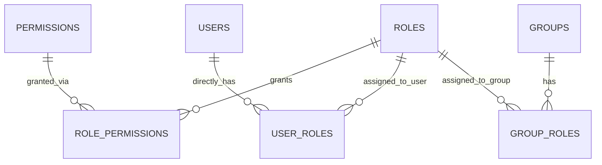

# Design: IAM Roles

## Architecture

The IAM Roles feature follows Clean Architecture layering. It spans all four layers:

```
┌─────────────────────────────────────────────────────────────────────┐
│  Adapters (Layer 3)                                                 │
│  ┌──────────────────────────────────────────────────────────────┐   │
│  │  HTTP Handlers:                                               │   │
│  │  - list_roles_handler   GET    /api/v1/roles                 │   │
│  │  - create_role_handler  POST   /api/v1/roles                 │   │
│  │  - get_role_handler     GET    /api/v1/roles/{id}            │   │
│  │  - update_role_handler  PATCH  /api/v1/roles/{id}            │   │
│  │                                                              │   │
│  │  Request/Response Schemas:                                    │   │
│  │  - CreateRoleRequest / CreateRoleResponse                    │   │
│  │  - UpdateRoleRequest / RoleDetailResponse                    │   │
│  │  - RoleListResponse                                          │   │
│  └──────────┬───────────────────────────────────────────────────┘   │
│             │ calls                                                  │
│             ▼                                                        │
│  Application (Layer 2)                                              │
│  ┌──────────────────────────────────────────────────────────────┐   │
│  │  RoleService                                                  │   │
│  │  - list(ctx, pagination) -> (roles, total)                    │   │
│  │  - create(ctx, cmd) -> Role                                   │   │
│  │  - get_by_id(ctx, id) -> Role (with permissions)              │   │
│  │  - update(ctx, id, cmd) -> Role                               │   │
│  │                                                               │   │
│  │  RoleRepository (interface)                                   │   │
│  │  - find_all(ctx, pagination) -> ([]Role, total)               │   │
│  │  - find_by_id(ctx, id) -> Option<Role>                        │   │
│  │  - find_by_name(ctx, name) -> Option<Role>                    │   │
│  │  - save(ctx, Role) -> Role                                    │   │
│  │  - update(ctx, Role) -> Role                                  │   │
│  │  - set_permissions(ctx, role_id, permission_ids)              │   │
│  │  - get_permissions(ctx, role_id) -> []Permission              │   │
│  │                                                               │   │
│  │  PermissionRepository (interface, reused)                     │   │
│  │  - find_all_by_id(ctx, ids) -> []Permission                   │   │
│  └──────────┬───────────────────────────────────────────────────┘   │
│             │ delegates to                                           │
│             ▼                                                        │
│  Infrastructure (Layer 4)                                           │
│  ┌──────────────────────────────────────────────────────────────┐   │
│  │  SqlRoleRepository  (implements RoleRepository)               │   │
│  │  - PostgreSQL queries for ROLES + ROLE_PERMISSIONS tables     │   │
│  └──────────────────────────────────────────────────────────────┘   │
└─────────────────────────────────────────────────────────────────────┘
```

**Flow summary:**

1. A role management request arrives at the HTTP handler, which validates the request body.
2. The handler calls the corresponding `RoleService` method.
3. `RoleService` uses `RoleRepository` to query or persist role data.
4. For create/update, `RoleService` validates uniqueness of the name and existence of permission
   IDs via `PermissionRepository`.
5. For permission assignments, `RoleService` delegates to `RoleRepository::set_permissions()`
   which performs a transaction-scoped delete + insert on `ROLE_PERMISSIONS`.
6. The handler serializes the result into the response schema.

**Permission inheritance is computed at query time** in the `auth-rbac` feature (not in this
feature). The IAM Roles feature only stores the role-to-permission and user/group-to-role
assignments. The union computation lives in the authorization middleware.

---

## API Contract

### GET `/api/v1/roles`

Paginated list of all roles.

**Required Permission:** `role:read_list`

**Query Parameters:**

| Parameter | Type | Default | Description |
|-----------|------|---------|-------------|
| `page` | integer | `1` | Page number (1-based) |
| `limit` | integer | `25` | Items per page (max 100) |

**Success Response:** `200 OK`

```json
{
  "data": [
    {
      "id": 1,
      "name": "Tester",
      "permission_count": 6,
      "created_at": "2026-07-14T10:00:00Z",
      "created_by": 1,
      "updated_at": "2026-07-14T10:00:00Z",
      "updated_by": 1
    }
  ],
  "meta": {
    "total": 5,
    "page": 1,
    "limit": 25
  }
}
```

**Error Responses:**

| Status | Code | Condition |
|--------|------|-----------|
| `401` | `NOT_AUTHENTICATED` | No valid session |
| `403` | `FORBIDDEN` | User lacks `role:read_list` permission |

---

### POST `/api/v1/roles`

Create a new role with permission assignments.

**Required Permission:** `role:create`

**Request Headers:** `Content-Type: application/json`

**Request Body:**

```json
{
  "name": "Tester",
  "permission_ids": [1, 2, 5, 8, 12, 15]
}
```

| Field | Type | Required | Description |
|-------|------|----------|-------------|
| `name` | string | Yes | Unique role name. Case-insensitive uniqueness. Cannot be "System Admin". |
| `permission_ids` | array[integer] | Yes | At least one permission ID. All must exist in the `PERMISSIONS` table. |

**Success Response:** `201 Created`

```json
{
  "data": {
    "id": 6,
    "name": "Tester",
    "permissions": [
      { "id": 1, "code": "test_case:create", "name": "Create Test Case" },
      { "id": 2, "code": "test_case:read", "name": "Read Test Case" }
    ],
    "created_at": "2026-07-14T10:00:00Z",
    "created_by": 1,
    "updated_at": "2026-07-14T10:00:00Z",
    "updated_by": 1
  }
}
```

**Error Responses:**

| Status | Code | Condition |
|--------|------|-----------|
| `401` | `NOT_AUTHENTICATED` | No valid session |
| `403` | `FORBIDDEN` | User lacks `role:create` permission |
| `409` | `DUPLICATE_ROLE_NAME` | Role name already exists (case-insensitive) |
| `422` | `VALIDATION_ERROR` | Missing `name` or `permission_ids`, empty `permission_ids`, or invalid permission IDs |
| `422` | `RESERVED_NAME` | Name is "System Admin" (case-insensitive) |

---

### GET `/api/v1/roles/{id}`

Get role detail with assigned permissions.

**Required Permission:** `role:read`

**Success Response:** `200 OK`

```json
{
  "data": {
    "id": 6,
    "name": "Tester",
    "permissions": [
      { "id": 1, "code": "test_case:create", "name": "Create Test Case" },
      { "id": 2, "code": "test_case:read", "name": "Read Test Case" }
    ],
    "created_at": "2026-07-14T10:00:00Z",
    "created_by": 1,
    "updated_at": "2026-07-14T10:00:00Z",
    "updated_by": 1
  }
}
```

**Error Responses:**

| Status | Code | Condition |
|--------|------|-----------|
| `401` | `NOT_AUTHENTICATED` | No valid session |
| `403` | `FORBIDDEN` | User lacks `role:read` permission |
| `404` | `NOT_FOUND` | Role does not exist or is soft-deleted |

---

### PATCH `/api/v1/roles/{id}`

Update a role's name and/or replace its permission assignments.

**Required Permission:** `role:update`

**Request Body:**

```json
{
  "name": "Senior Tester",
  "permission_ids": [1, 2, 3, 5, 8, 12, 15, 18]
}
```

| Field | Type | Required | Description |
|-------|------|----------|-------------|
| `name` | string | No | New unique name. Cannot rename the System Admin role. |
| `permission_ids` | array[integer] | No | Replaces the entire permission set. If provided, must have at least one element. |

Both fields are optional. At least one must be provided. Missing fields retain their current
values.

Permission replacement is atomic: the existing `ROLE_PERMISSIONS` rows for this role are deleted
and the new set is inserted within a single database transaction.

**Success Response:** `200 OK`

Body same shape as GET detail response, with updated values.

**Error Responses:**

| Status | Code | Condition |
|--------|------|-----------|
| `401` | `NOT_AUTHENTICATED` | No valid session |
| `403` | `FORBIDDEN` | User lacks `role:update` permission, OR attempting to modify System Admin role |
| `404` | `NOT_FOUND` | Role does not exist or is soft-deleted |
| `409` | `DUPLICATE_ROLE_NAME` | New name conflicts with an existing role |
| `422` | `VALIDATION_ERROR` | Empty `permission_ids`, invalid permission IDs, or no fields provided |
| `422` | `RESERVED_NAME` | Attempting to change another role's name to "System Admin" |
| `403` | `PROTECTED_ROLE` | Attempting to modify the System Admin role's name or permissions |

---

## Data Model

### New Tables

#### ROLES

| Column | Type | Constraints | Notes |
|--------|------|-------------|-------|
| `id` | `BIGINT` | `PK`, `GENERATED ALWAYS AS IDENTITY` | Surrogate key |
| `name` | `VARCHAR(255)` | `NOT NULL`, `UNIQUE` | Case-insensitive unique. "System Admin" is reserved. |
| `created_by` | `BIGINT` | `FK -> users(id)` | Nullable — the CLI bootstrap seeds the System Admin role before any user has an ID. Application-created roles have this set. |
| `created_at` | `TIMESTAMPTZ` | `NOT NULL`, `DEFAULT NOW()` | |
| `updated_by` | `BIGINT` | `FK -> users(id)` | Nullable — same reason as `created_by`. Set by the DB trigger for mutation tracking. |
| `updated_at` | `TIMESTAMPTZ` | `NOT NULL`, `DEFAULT NOW()` | |
| `deleted_by` | `BIGINT` | `FK -> users(id)` | Nullable |
| `deleted_at` | `TIMESTAMPTZ` | | Nullable. Soft-delete marker. |

**Indexes:**

- `PK` on `id`
- `UNIQUE` on `name` (case-insensitive — use `UNIQUE` index on `LOWER(name)` in PostgreSQL)
- `idx_roles_active` partial index: `CREATE INDEX idx_roles_active ON roles(id) WHERE deleted_at IS NULL`

**System Admin seed row:**

```sql
INSERT INTO roles (name, created_by, created_at, updated_by, updated_at)
VALUES ('System Admin', NULL, NOW(), NULL, NOW());
```

The seed is applied during database migrations. Unlike the `iam-users` bootstrap admin,
the System Admin role is seeded by migration (before any user exists), so `created_by`
and `updated_by` are NULL. The `iam-cli-init` feature later assigns this role to the
bootstrap admin user and the `BEFORE UPDATE` trigger maintains `updated_by` going forward.

#### ROLE_PERMISSIONS (junction)

| Column | Type | Constraints | Notes |
|--------|------|-------------|-------|
| `role_id` | `BIGINT` | `PK`, `NOT NULL`, `FK -> roles(id)` | Part of composite PK |
| `permission_id` | `BIGINT` | `PK`, `NOT NULL`, `FK -> permissions(id)` | Part of composite PK |
| `created_at` | `TIMESTAMPTZ` | `NOT NULL`, `DEFAULT NOW()` | Junction tables carry `created_at` only |

**Constraints:**

- Composite primary key: `PRIMARY KEY (role_id, permission_id)`
- `FOREIGN KEY (role_id) REFERENCES roles(id) ON DELETE RESTRICT` — roles are soft-deleted
  (not SQL-deleted), so RESTRICT is the correct default per FR-53.
- `FOREIGN KEY (permission_id) REFERENCES permissions(id) ON DELETE RESTRICT` — permissions
  are read-only and cannot be deleted while referenced

**Indexes:**

- Composite PK covers lookups by `role_id` + `permission_id`
- Additional index on `permission_id` for reverse lookups:
  `CREATE INDEX idx_role_permissions_permission_id ON role_permissions(permission_id)`

#### USER_ROLES (junction — defined in `iam-roles` but shared with `iam-users`)

| Column | Type | Constraints | Notes |
|--------|------|-------------|-------|
| `user_id` | `BIGINT` | `PK`, `NOT NULL`, `FK -> users(id)` | Part of composite PK |
| `role_id` | `BIGINT` | `PK`, `NOT NULL`, `FK -> roles(id)` | Part of composite PK |
| `created_at` | `TIMESTAMPTZ` | `NOT NULL`, `DEFAULT NOW()` | Junction tables carry `created_at` only |

**Constraints:**

- Composite PK: `PRIMARY KEY (user_id, role_id)`
- `FOREIGN KEY (user_id) REFERENCES users(id) ON DELETE RESTRICT` — per FR-53, no cascade.
  Users are soft-deleted, so SQL DELETE is never issued, but the FK must use RESTRICT.
- `FOREIGN KEY (role_id) REFERENCES roles(id) ON DELETE RESTRICT` — roles are not
  user-deletable in Phase 1.

**Indexes:**

- Composite PK covers lookup by user
- Additional index on `role_id`:
  `CREATE INDEX idx_user_roles_role_id ON user_roles(role_id)`

#### GROUP_ROLES (junction — defined in `iam-roles` but shared with `iam-groups`)

| Column | Type | Constraints | Notes |
|--------|------|-------------|-------|
| `group_id` | `BIGINT` | `PK`, `NOT NULL`, `FK -> groups(id)` | Part of composite PK |
| `role_id` | `BIGINT` | `PK`, `NOT NULL`, `FK -> roles(id)` | Part of composite PK |
| `created_at` | `TIMESTAMPTZ` | `NOT NULL`, `DEFAULT NOW()` | Junction tables carry `created_at` only |

**Constraints:**

- Composite PK: `PRIMARY KEY (group_id, role_id)`
- `FOREIGN KEY (group_id) REFERENCES groups(id) ON DELETE RESTRICT` — per FR-53, parent deletion must not cascade to junction rows. Groups use soft-delete so SQL DELETE is never issued, but the FK rule must be RESTRICT to prevent accidental cascade.
- `FOREIGN KEY (role_id) REFERENCES roles(id) ON DELETE RESTRICT` — roles are not user-deletable in Phase 1; RESTRICT is the correct default.

**Indexes:**

- Additional index on `role_id`:
  `CREATE INDEX idx_group_roles_role_id ON group_roles(role_id)`

### ERD (Roles section of the full data model)



### Configuration (environment variables)

No new environment variables. This feature reuses the database connection configured for the
application.

---

## Sequence

### Create Role Flow

1. Client sends `POST /api/v1/roles` with `{"name": "Tester", "permission_ids": [1, 2, 5]}`.
2. HTTP handler deserializes and validates the request body:
   - `name` is required and non-empty
   - `permission_ids` is required and non-empty
   - `name` must not equal "System Admin" (case-insensitive)
3. Handler calls `RoleService::create(ctx, cmd)`.
4. `RoleService` calls `RoleRepository::find_by_name(name)` to check uniqueness (case-insensitive).
5. If a role with the same name exists and is not soft-deleted, return `DuplicateRoleName` error.
6. `RoleService` calls `PermissionRepository::find_all_by_id(permission_ids)` to verify all
   permission IDs exist.
7. If any permission ID is invalid, return `ValidationError` with the list of invalid IDs.
8. `RoleService` constructs a `Role` domain entity with `name`, sets `created_by`/`updated_by`
   from the authenticated user's ID, and sets `created_at`/`updated_at` to now.
9. `RoleService` calls `RoleRepository::save(role)` to insert the role row.
10. `RoleService` calls `RoleRepository::set_permissions(role.id, permission_ids)` to insert
    the `ROLE_PERMISSIONS` junction rows (runs in the same transaction as step 9).
11. `RoleService` calls `RoleRepository::get_permissions(role.id)` to load the assigned
    permissions for the response.
12. Handler returns `201 Created` with the role detail.

### Update Role Flow

1. Client sends `PATCH /api/v1/roles/{id}` with `{"name": "Senior Tester", "permission_ids": [...]}`.
2. HTTP handler deserializes the request body. At least one of `name` or `permission_ids` must
   be present.
3. Handler calls `RoleService::update(ctx, id, cmd)`.
4. `RoleService` calls `RoleRepository::find_by_id(id)`.
5. If the role does not exist or is soft-deleted, return `RoleNotFound` error (`404`).
6. If the role is "System Admin" (by name check), return `ProtectedRole` error (`403`).
7. If `name` is provided:
   a. Normalise to "System Admin" rejection (case-insensitive) — same error.
   b. Call `RoleRepository::find_by_name(new_name)` — if another role (different `id`) has this
      name and is not soft-deleted, return `DuplicateRoleName` error (`409`).
8. If `permission_ids` is provided:
   a. Validate all IDs exist via `PermissionRepository::find_all_by_id()`.
   b. Call `RoleRepository::set_permissions(role.id, permission_ids)` — atomic delete + insert
      in a transaction.
9. Update the role's `name`, `updated_by`, and `updated_at` fields.
10. Call `RoleRepository::update(role)` to persist the changes.
11. Return `200 OK` with the updated role detail.

### Permission Inheritance Computation (at authorization time, in `auth-rbac`)

1. On every request, after authentication, the authorization middleware loads the user's effective
   permissions.
2. The middleware queries:
   ```sql
   SELECT DISTINCT rp.permission_id
   FROM user_roles ur
   JOIN role_permissions rp ON rp.role_id = ur.role_id
   WHERE ur.user_id = $1
   UNION
   SELECT DISTINCT rp.permission_id
   FROM user_groups ug
   JOIN group_roles gr ON gr.group_id = ug.group_id
   JOIN role_permissions rp ON rp.role_id = gr.role_id
   WHERE ug.user_id = $1
   ```
3. The result is a deduplicated set of permission IDs for the user.
4. The middleware checks whether the required permission ID is in this set.
5. The result is not cached beyond the current request — it is computed fresh on every
   authorization check.

---

## Components

### New Components

| Component | Layer | Role |
|-----------|-------|------|
| `Role` | Domain (1) | Entity representing a role: `id`, `name`, audit fields (`created_by: Option<i64>`, `updated_by: Option<i64>`). Behaviours: `can_rename()`, `is_protected()`. |
| `RoleService` | Application (2) | Orchestrates role CRUD operations. Validates uniqueness, permission existence, and System Admin protection rules. |
| `RoleRepository` | Application (2) | Interface for role persistence: CRUD + permission assignment operations. |
| `ListRolesHandler` | Adapters (3) | HTTP handler for `GET /api/v1/roles`. Calls `RoleService::list()` with pagination params. |
| `CreateRoleHandler` | Adapters (3) | HTTP handler for `POST /api/v1/roles`. Validates body, calls `RoleService::create()`. |
| `GetRoleHandler` | Adapters (3) | HTTP handler for `GET /api/v1/roles/{id}`. Calls `RoleService::get_by_id()`. |
| `UpdateRoleHandler` | Adapters (3) | HTTP handler for `PATCH /api/v1/roles/{id}`. Validates body, calls `RoleService::update()`. |
| `RoleListSchema` | Adapters (3) | Request/response structs with serde serialization for role list, create, detail, and update. |
| `SqlRoleRepository` | Infrastructure (4) | Implements `RoleRepository` using SQLx or Diesel. Handles `ROLE_PERMISSIONS` transaction. |

### Modified Existing Components

| Component | Change |
|-----------|--------|
| HTTP router registration | Register four new role routes: `GET /api/v1/roles`, `POST /api/v1/roles`, `GET /api/v1/roles/{id}`, `PATCH /api/v1/roles/{id}` |
| Seed/migration system | Add seed migration for the "System Admin" role and seed its `ROLE_PERMISSIONS` rows with all existing permission IDs |
| `PermissionRepository` (application layer, if exists) | Ensure `find_all_by_id(ids)` method is available for role validation |

### Compile-time interface checks (Rust convention)

```rust
// - `SqlRoleRepository` implements `RoleRepository`
// - The trait system enforces method signature matching at compile time.
```

---

## Error Handling

| Error Case | HTTP Status | Error Code | Log Level | Notes |
|------------|-------------|------------|-----------|-------|
| Missing or invalid session | `401` | `NOT_AUTHENTICATED` | INFO | Handled by auth middleware |
| Missing `role:read_list` / `role:read` / `role:create` / `role:update` | `403` | `FORBIDDEN` | INFO | User authenticated but lacks required permission |
| Attempt to modify System Admin role | `403` | `PROTECTED_ROLE` | WARN | Name change, permission change, or deletion attempt |
| Role not found or soft-deleted | `404` | `NOT_FOUND` | INFO | Single message — no distinction between "never existed" and "was deleted" |
| Duplicate role name on create/update | `409` | `DUPLICATE_ROLE_NAME` | INFO | Case-insensitive comparison |
| Request body validation failure | `422` | `VALIDATION_ERROR` | INFO | Includes field-level detail list |
| "System Admin" used as name for non-admin role | `422` | `RESERVED_NAME` | INFO | Prevent impersonation of the reserved role |
| Invalid permission IDs in `permission_ids` | `422` | `VALIDATION_ERROR` | INFO | Field-level detail lists which IDs are invalid |
| Internal database error | `500` | `INTERNAL_ERROR` | ERROR | Unexpected failure; no details exposed to client |
| Redis unreachable (session check) | `503` | `SESSION_STORE_UNAVAILABLE` | ERROR | From auth middleware — all authenticated requests fail if Redis is down |

**Additional security controls:**

- **XSS protection:** Role `name` is a user-controlled display field shown throughout the UI
  (group detail, user profile, permission screens). Strip HTML tags on input to prevent stored
  XSS. Enforce maximum length of 255 characters at the application layer.
- **System Admin audit trail:** Because the System Admin bypasses all authorization checks,
  every mutation performed by a System Admin user (role updates, permission changes, user
  deactivation, soft-delete) should be logged at WARN level in the application log with the
  System Admin's user ID, the action performed, and the target resource. This provides
  non-repudiation for privileged operations that bypass standard permission checks.
